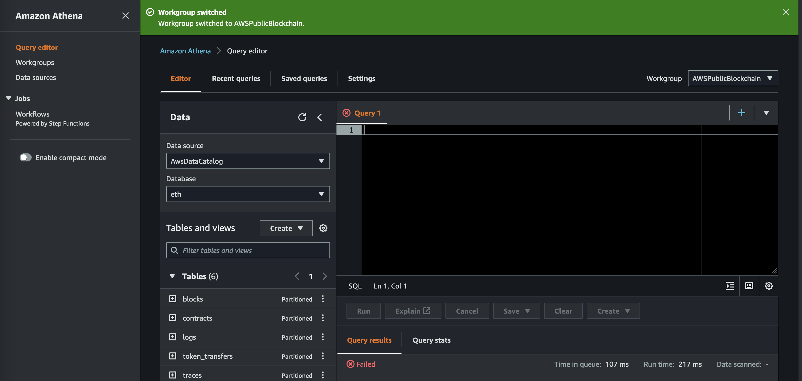
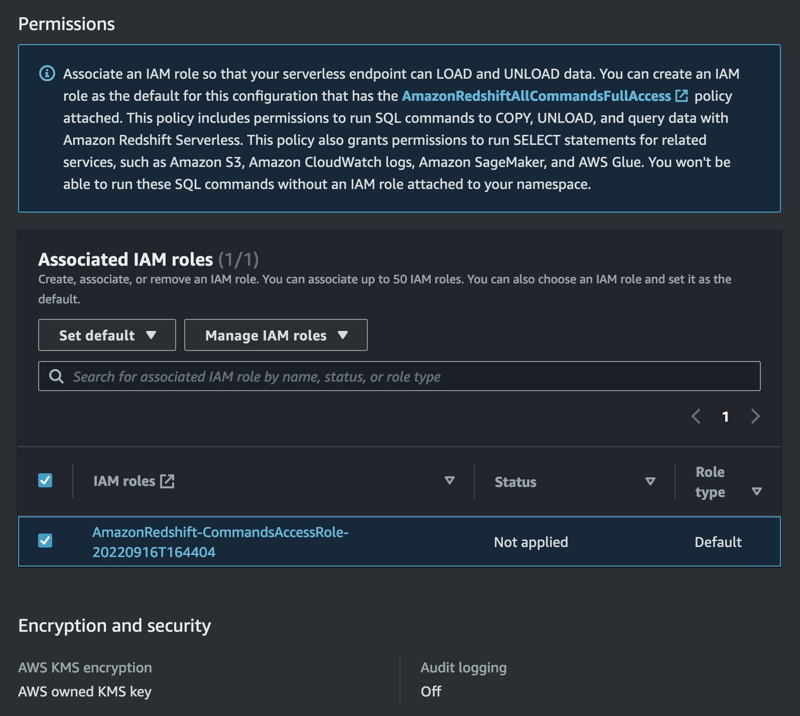
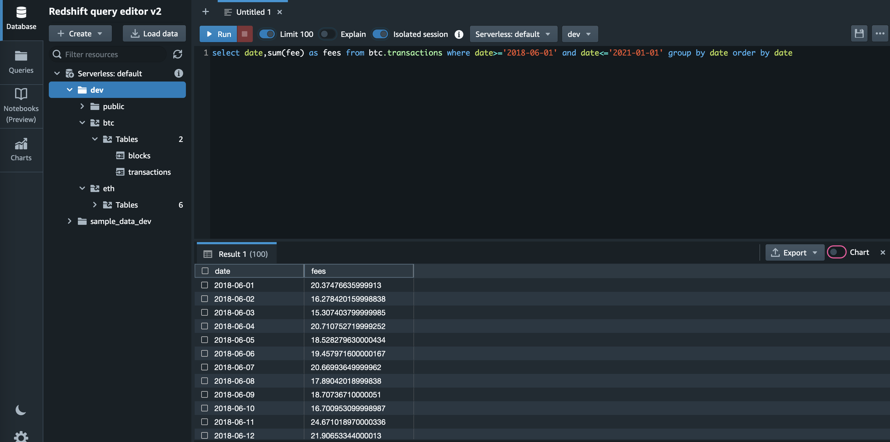

# Bitcoin and Ethereum Blockchain Data

This open-source solution pulls data from the public Bitcoin and Ethereum blockchains and normalizes data into tabular data structures for blocks, transactions, and additional tables for data inside a block. The data is provided as parquet files partioned by date to provide an easy query interface through services like Amazon Athena, Amazon Redshift, and Amazon SageMaker.

## Architecture


## How to consume this data from AWS

You can consume this data using differnt tools like Amazon Athena, Amazon Redshift, and Amazon Sagemaker. To get started run the following AWS CloudFormation template in your AWS Account. If you are using Redshift, make sure you deploying this template in ***us-east-2*** region, for Athena and Sagemaker this can be deployed in any region.

[Deploy Stack](https://console.aws.amazon.com/cloudformation/home?region=us-east-2#/stacks/new?stackName=aws-public-blockchain&templateURL=https://aws-blogs-artifacts-public.s3.amazonaws.com/artifacts/DBBLOG-2500/aws-public-blockchain.yaml)
 
 Above deployment will provision all necessary resources, security configurations, data partitions, and tables. Now you can use any of the following services to query and do analysis.

 ## Amazon Athena

 Open Athena and select workgroup ***AWSPublicBlockchain***

 


 


 ## Amazon Redshift

 ### Create Amazon Redshift Serverless database

 Go to the [Amazon Redshift](https://console.aws.amazon.com/redshift/home) console and choose the new serverless option. Confirm all the default settings.


### Associate a new IAM role

Create a new default IAM role and give permissions to access other AWS resources and to be able to load data from a S3 bucket. 




Keep rest of the defaults and create.


### Open query editor and create schema

Replace ***account*** and ***role*** with your details and execute the following statements.

```sql
create external schema btc
from data catalog
database 'btc' 
iam_role 'arn:aws:iam::{account}:role/service-role/{role}'
create external database if not exists;

create external schema eth
from data catalog
database 'eth' 
iam_role 'arn:aws:iam::{account}:role/service-role/{role}'
create external database if not exists;
```


### Start exploring and analyzing the data

```sh
select * from btc.blocks limit 1;
select * from btc.transactions  limit 1;

select * from eth.blocks limit 1;
select * from eth.transactions limit 1;
```




## Amazon SageMaker

Follow the instructions from [here](notebooks.md)

## How to setup this solution in your own AWS account 

Follow the instructions from [here](producer/README.md)

## Security

See [CONTRIBUTING](CONTRIBUTING.md#security-issue-notifications) for more information.

## License

This library is licensed under the MIT-0 License. See the LICENSE file.